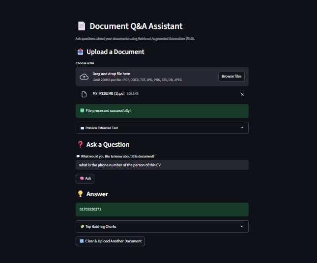

# 🧠 RAG_QA_App – Document Question Answering using Retrieval-Augmented Generation (RAG)

This project is a simple yet powerful **Retrieval-Augmented Generation (RAG)** system that allows users to upload documents (PDF, TXT, CSV, images, etc.) and ask questions about them. The backend is powered by FastAPI and FAISS, and the frontend is built using Streamlit for an interactive experience.

---

## 🚀 Features

- 📄 Upload PDFs, DOCX, TXT, JPG, PNG, CSV files
- 🔍 Automatic OCR for scanned images using Tesseract
- ✂️ Intelligent text chunking
- 🧠 Vector embeddings using Sentence Transformers (`all-MiniLM-L6-v2`)
- ⚡ Fast document search with FAISS
- 🤖 Question answering using `google/flan-t5-base`
- 💬 Interactive UI using Streamlit
- 🧠 Auto-detection of document type (e.g., CV, invoice, etc.)

---

## 🖼️ Demo

Upload a document ➜ Extract text ➜ Ask a question ➜ Get an answer.


---

## 🛠️ Tech Stack

- **Backend**: FastAPI
- **Frontend**: Streamlit
- **Vector Search**: FAISS
- **Embeddings**: SentenceTransformers
- **LLM**: Google FLAN-T5 (`google/flan-t5-base`)
- **OCR**: Tesseract
- **Language**: Python 3.10+

---

## ⚙️ Setup Instructions

1. **Clone the repository**:

   ```bash
   git clone https://github.com/ariyanshuddho/RAG_QA_App.git
   cd RAG_QA_App
````

2. **Create and activate a virtual environment**:

   ```bash
   python -m venv venv
   venv\Scripts\activate   # Windows
   ```

3. **Install dependencies**:

   ```bash
   pip install -r requirements.txt
   ```

4. **Install Tesseract OCR**
   [Download Tesseract](https://github.com/tesseract-ocr/tesseract) and make sure it's added to your system PATH.

---

## 📁 Project Structure

```
RAG_QA_App/
├── app/
│   ├── main.py
│   ├── routes/
│   ├── services/
│   └── utils/
├── data/
├── faiss_store/
├── requirements.txt
├── streamlit_app.py
└── README.md
```

---

## ⚠️ Note on `.venv`

> The `.venv/` folder (virtual environment) has been **intentionally excluded** from the repository due to size constraints and GitHub's 100MB file limit. Please recreate it locally using the provided `requirements.txt`.

---

## 🤝 Contributions

PRs are welcome! If you'd like to contribute, feel free to fork the repo and submit a pull request.

---

## 📜 License

This project is open source and available under the [MIT License](LICENSE).

---

## 👤 Author

* **Ariyan Shuddho**
  [GitHub](https://github.com/ariyanshuddho) | [Email](mailto:mirariyanshuddho@gmail.com)

```

---


